# Materialy na zajecia - wizualizacja rozkładów
Maciej Beręsewicz  
6 Mar 2015  

# Podstawowe informacje o zajęciach

**Cel zajęć**:

 * wskazanie sposobów wizualizacji zmiennych ciągłych jednowymiarowych (nie interesuje nas zależność między dwiema cechami ciągłymi)
 * wwskazanie sposób wizualizacji zmiennych ciągłych jednowymiarowych według grup

**W trakcie zajęć proszę aktywizuj studentów m.in. w następujący sposób**:

 * zanim zaczniesz wizualizację danych zapytaj o przykłady zmiennych ciągłych :)
 * czy znają sposoby wizualizacji danych ilościowych? 
 * zapytaj jakby podeszli do wizualizacji danych dotyczących dochodów na podstawie załączonego zbioru danych? Najlepiej żeby poprzychodzili do tablicy i pomazali trochę
 
W trakcie zajęć staraj się najpierw coś namalować na tablicy a później pomyśleć jakby mogłoby to wyglądać w R.

**Cel tworzenia wykresów dla zmiennych ciągłych**:

  * szukanie wartości odstających i outlierów, lub po prostu błędów w danych. Nie wnikaj w tej chwili co to są wartości odstające czy outliery.
  * wizualizacja rozkładu zmiennych - przypomnij im o rozkładach asymetrycznych, rozkładzie normalnym
  * porównanie rozkładów zmiennych
  
**Wykresy do zrealizowania**:

  * wykres punktowy gdzie na osi X jest numer respondenta, a na Y jest wartość cechy aby zobaczyć czy są jakieś wartości odstające (geom_point)
  * wykres gęstości (geom_density)
  * histogram (geom_histogram)
  * wykres pudełkowy (geom_boxplot)
  
Pamiętaj o sterowaniu argumentem **alpha** do zwiększania/zmiejszania prześwitu

# Kody R na zajęcia - możesz też improwizować w zależności od tego co będzie się działo


```r
library(dplyr)
library(ggplot2)
library(tidyr)
library(XLConnect)
library(scales)

setwd("/Users/MaciejBeresewicz/Documents/Projects/RProjects/Dydaktyka")
wb <- loadWorkbook('WIRDS/datasets/gospodarstwa.xls')
gosp <- readWorksheet(wb,'gospodarstwa')
vars <- readWorksheet(wb,'opis cech')
vars_labels <- readWorksheet(wb,'opis wariantów cech')
gosp <- tbl_df(gosp)
```

## Badanie wg numeru respondenta


```r
gosp %>%
  mutate(ID = row_number()) %>%
  ggplot(data=.,
         aes(x = ID,
             y= dochg)) +
  geom_point()
```

```
## Warning: Removed 36 rows containing missing values (geom_point).
```

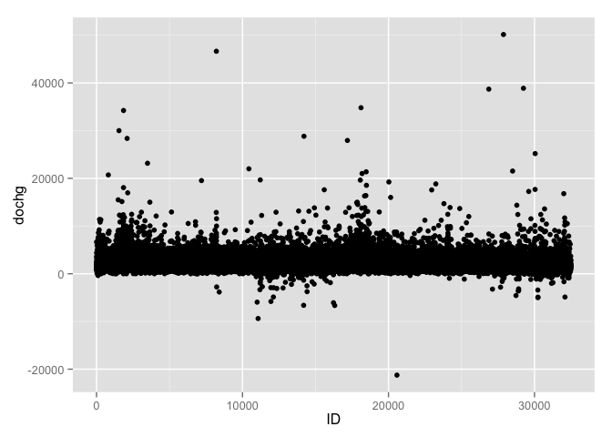 

## Histogram

Dla wszystkich obserwacji


```r
gosp %>% 
  ggplot(data = .,
         aes(x= dochg)) +
  geom_histogram()
```

```
## stat_bin: binwidth defaulted to range/30. Use 'binwidth = x' to adjust this.
```

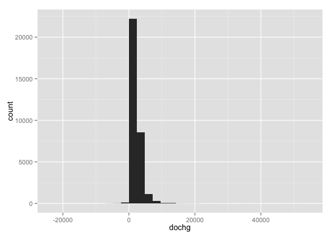 

Małe zmiany do histogramu i wykresu


```r
gosp %>% 
  ggplot(data = .,
         aes(x= dochg)) +
  geom_histogram(fill=NA, ## brak wypełnienia
                 colour='black', ## kolor ramki
                 binwidth=100) + ## co 100 złotych
  theme_bw()
```

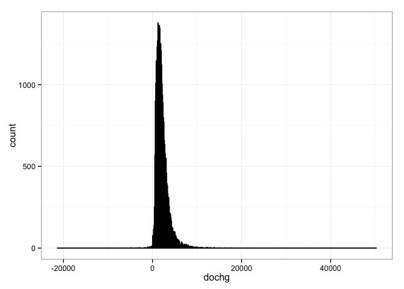 

Ograniczymy do 0-20000 i zobaczymy jak wyglądają zaokrąglenia w danych


```r
gosp %>% 
  ggplot(data = .,
         aes(x= dochg)) +
  geom_histogram(fill=NA, ## brak wypełnienia
                 colour='black', ## kolor ramki
                 binwidth=10) + ## co 10 złotych
  theme_bw() +
  scale_x_continuous(limits=c(0,2e4))
```

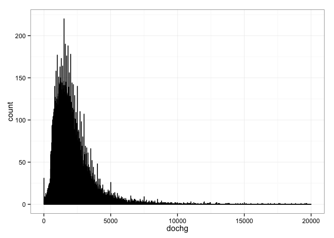 


Wrócmy do porównania rozkładów wg województw - pierwsze podejście 


```r
gosp %>% 
  ggplot(data = .,
         aes(x= dochg,
             fill = woj)) +
  geom_histogram()
```

```
## stat_bin: binwidth defaulted to range/30. Use 'binwidth = x' to adjust this.
```

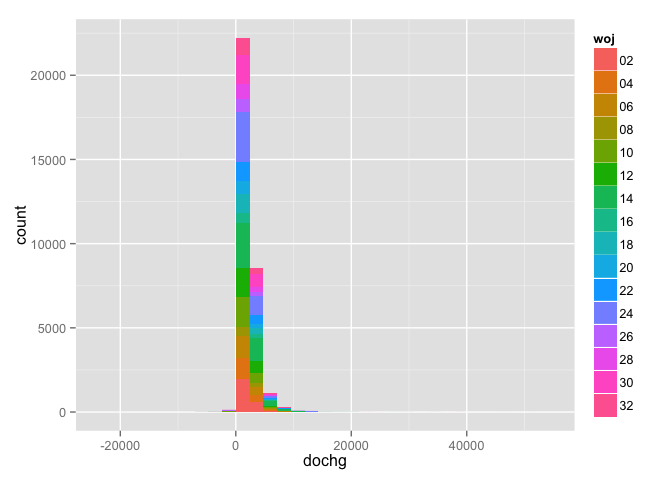 

To nie jest to co nas interesowało. Jak zrobić poprawne porównanie?


```r
gosp %>% 
  ggplot(data = .,
         aes(x= dochg)) +
  geom_histogram() +
  facet_wrap(~woj)
```

```
## stat_bin: binwidth defaulted to range/30. Use 'binwidth = x' to adjust this.
## stat_bin: binwidth defaulted to range/30. Use 'binwidth = x' to adjust this.
## stat_bin: binwidth defaulted to range/30. Use 'binwidth = x' to adjust this.
## stat_bin: binwidth defaulted to range/30. Use 'binwidth = x' to adjust this.
## stat_bin: binwidth defaulted to range/30. Use 'binwidth = x' to adjust this.
## stat_bin: binwidth defaulted to range/30. Use 'binwidth = x' to adjust this.
## stat_bin: binwidth defaulted to range/30. Use 'binwidth = x' to adjust this.
## stat_bin: binwidth defaulted to range/30. Use 'binwidth = x' to adjust this.
## stat_bin: binwidth defaulted to range/30. Use 'binwidth = x' to adjust this.
## stat_bin: binwidth defaulted to range/30. Use 'binwidth = x' to adjust this.
## stat_bin: binwidth defaulted to range/30. Use 'binwidth = x' to adjust this.
## stat_bin: binwidth defaulted to range/30. Use 'binwidth = x' to adjust this.
## stat_bin: binwidth defaulted to range/30. Use 'binwidth = x' to adjust this.
## stat_bin: binwidth defaulted to range/30. Use 'binwidth = x' to adjust this.
## stat_bin: binwidth defaulted to range/30. Use 'binwidth = x' to adjust this.
## stat_bin: binwidth defaulted to range/30. Use 'binwidth = x' to adjust this.
```

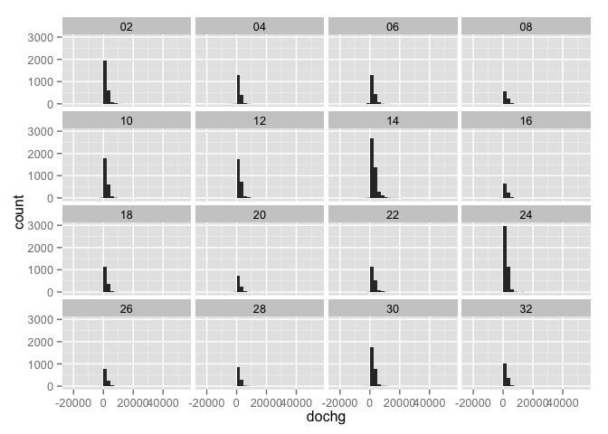 

Ograniczmy jeszcze os dla czytelności


```r
gosp %>% 
  ggplot(data = .,
         aes(x= dochg)) +
  geom_histogram(fill=NA, ## brak wypełnienia
                 colour='black', ## kolor ramki
                 binwidth=10) + ## co 10 złotych
  theme_bw() +
  facet_wrap(~woj) + 
  scale_x_continuous(limits=c(0,2e4))
```

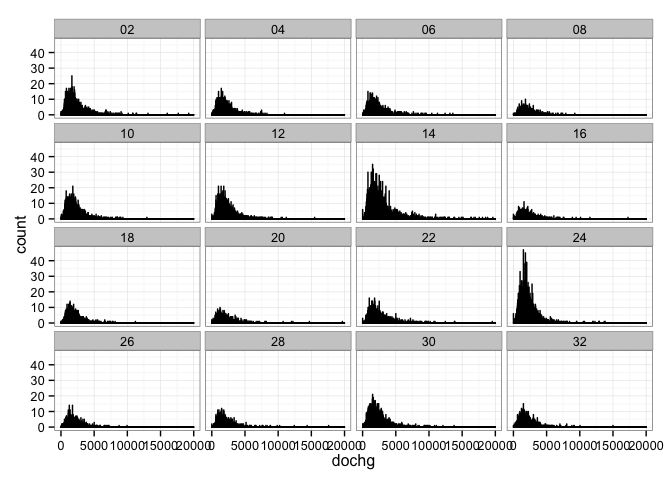 

A jak wygląda to wg klasy wielkości miejscowości?


```r
gosp %>% 
  ggplot(data = .,
         aes(x= dochg)) +
  geom_histogram(fill=NA, ## brak wypełnienia
                 colour='black', ## kolor ramki
                 binwidth=10) + ## co 10 złotych
  theme_bw() +
  facet_wrap(~klm) + 
  scale_x_continuous(limits=c(0,2e4))
```

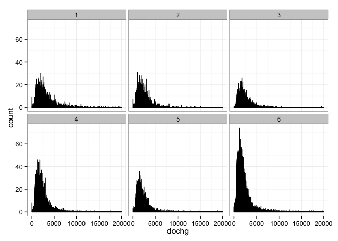 

A jak wyglądają wydatki?


```r
gosp %>% 
  ggplot(data = .,
         aes(x= wydg)) +
  geom_histogram(fill=NA, ## brak wypełnienia
                 colour='black', ## kolor ramki
                 binwidth=10) + ## co 10 złotych
  theme_bw() +
  facet_wrap(~klm)
```

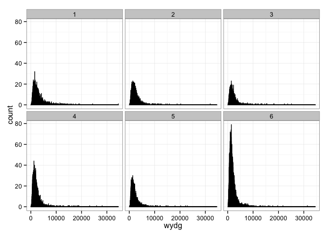 

Może użyjmy logarytmu dziesiętnego aby zobaczyć co się dzieje - czyli jak pokazać różnice w lepszy sposób! Czy ten rozkład jest teraz zbliżony do normalnego?


```r
gosp %>% 
  ggplot(data = .,
         aes(x= wydg)) +
  geom_histogram(fill=NA, ## brak wypełnienia
                 colour='black') + ## co 10 złotych
  theme_bw() +
  facet_wrap(~klm) +
  scale_x_log10()
```

```
## stat_bin: binwidth defaulted to range/30. Use 'binwidth = x' to adjust this.
## stat_bin: binwidth defaulted to range/30. Use 'binwidth = x' to adjust this.
## stat_bin: binwidth defaulted to range/30. Use 'binwidth = x' to adjust this.
## stat_bin: binwidth defaulted to range/30. Use 'binwidth = x' to adjust this.
## stat_bin: binwidth defaulted to range/30. Use 'binwidth = x' to adjust this.
## stat_bin: binwidth defaulted to range/30. Use 'binwidth = x' to adjust this.
```

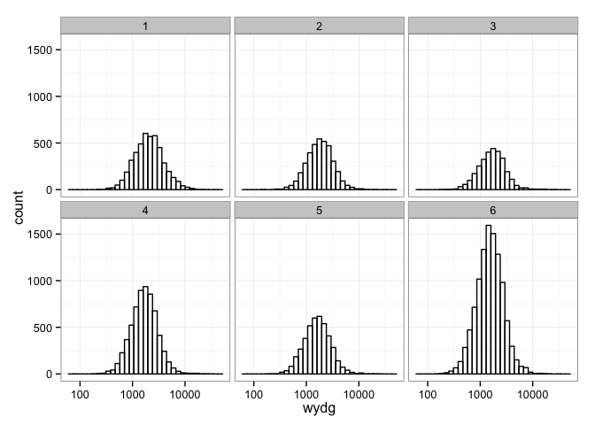 


## Wykresy gęstości

Jaka jest różnica miedzy histogramem, a wykresem gęstości? Podstawą jest [http://pl.wikipedia.org/wiki/Estymator_jądrowy_gęstości](jądrowy estymator gęstości) (ang. *kernel density estimation*).

Niech dana będzie n-wymiarowa zmienna losowa $X$, której rozkład posiada gęstość f. Jej estymator jądrowy $\hat{f} : \mathbb{R}^n \to [0,\infty)$ wyznacza się w oparciu o wartości $m$-elementowej próby losowej: $x_1, x_2, ..., x_m$, uzyskanej ze zmiennej X, i w swej podstawowej formie jest on definiowany wzorem

$$
\hat{f}(x) = \frac{1}{mh^n}\sum_{i=1}^{m} K\left(\frac{x-x_i}{h}\right) 
$$

gdzie mierzalna, symetryczna względem zera oraz posiadająca w tym punkcie słabe maksimum globalne funkcja $K : \mathbb{R}^n \to [0,\infty)$ spełnia warunek $\int_{\mathbb{R}^n}{K(x)dx}=1$ i nazywana jest jądrem, natomiast dodatni współczynnik $h$ określa się mianem parametru wygładzania.

Spróbujmy wykorzystać tę wiedzę do stworzenia wykresu gęstości dla wydatków.


```r
p <- gosp %>% 
  ggplot(data = .,
         aes(x= wydg)) +
  geom_density() + 
  theme_bw()
p
```

```
## Warning: Removed 36 rows containing non-finite values (stat_density).
```

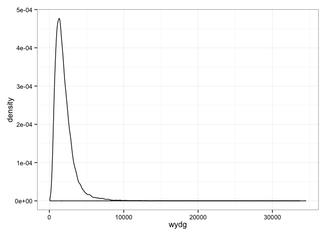 

Porównajmy teraz wydatki wg klasy wielkosci miejsowości


```r
p <- gosp %>% 
  mutate(klm = factor( x = klm,
                       levels = 6:1,
                       labels = c('Wieś',
                                  '<20',
                                  '[20,100)',
                                  '[100,200)',
                                  '[200,500)',
                                  '>=500'),
                       ordered = T)) %>%
  ggplot(data = .,
         aes(x= wydg,
             fill=klm)) +
  geom_density() + 
  theme_bw()
p
```

```
## Warning: Removed 1 rows containing non-finite values (stat_density).
```

```
## Warning: Removed 1 rows containing non-finite values (stat_density).
```

```
## Warning: Removed 2 rows containing non-finite values (stat_density).
```

```
## Warning: Removed 14 rows containing non-finite values (stat_density).
```

```
## Warning: Removed 2 rows containing non-finite values (stat_density).
```

```
## Warning: Removed 16 rows containing non-finite values (stat_density).
```

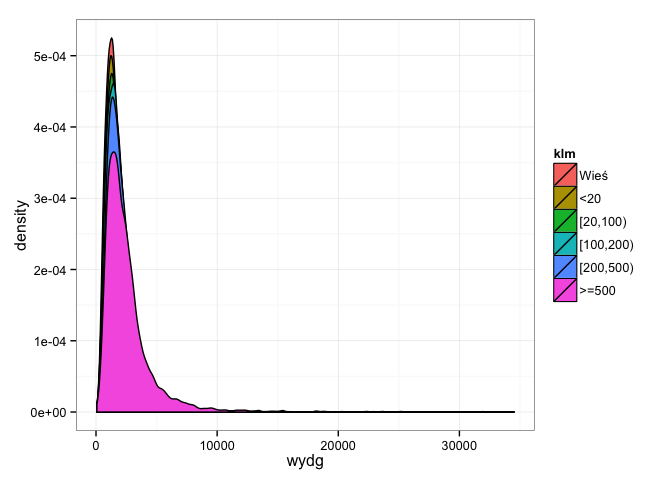 

Różnice nie są zbyt widoczne, dodajmy skalę logarytmiczną


```r
p + scale_x_log10()
```

```
## Warning: Removed 1 rows containing non-finite values (stat_density).
```

```
## Warning: Removed 1 rows containing non-finite values (stat_density).
```

```
## Warning: Removed 2 rows containing non-finite values (stat_density).
```

```
## Warning: Removed 14 rows containing non-finite values (stat_density).
```

```
## Warning: Removed 2 rows containing non-finite values (stat_density).
```

```
## Warning: Removed 16 rows containing non-finite values (stat_density).
```

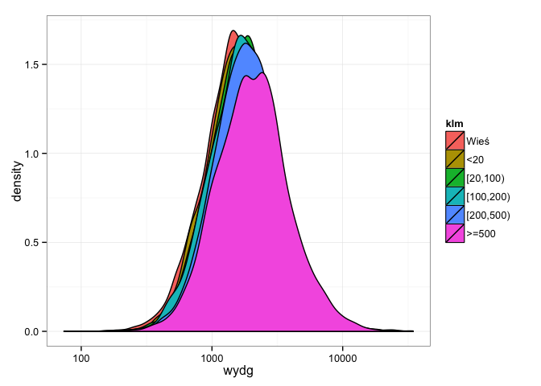 

Trochę lepiej ale warto też zmienić przezroczystość wykresów (parametr **alpha**)


```r
gosp %>% 
  mutate(klm = factor( x = klm,
                       levels = 6:1,
                       labels = c('Wieś',
                                  '<20',
                                  '[20,100)',
                                  '[100,200)',
                                  '[200,500)',
                                  '>=500'),
                       ordered = T)) %>%
  ggplot(data = .,
         aes(x= wydg,
             fill=klm)) +
  geom_density(alpha=0.2) + 
  theme_bw() + 
  scale_x_log10()
```

```
## Warning: Removed 1 rows containing non-finite values (stat_density).
```

```
## Warning: Removed 1 rows containing non-finite values (stat_density).
```

```
## Warning: Removed 2 rows containing non-finite values (stat_density).
```

```
## Warning: Removed 14 rows containing non-finite values (stat_density).
```

```
## Warning: Removed 2 rows containing non-finite values (stat_density).
```

```
## Warning: Removed 16 rows containing non-finite values (stat_density).
```

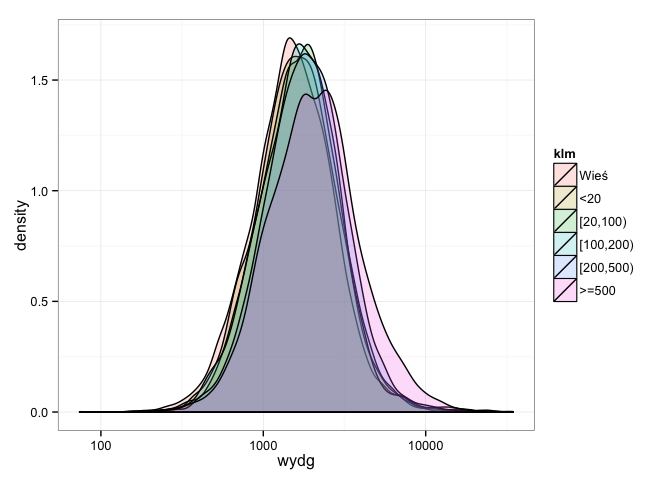 

Albo zamienić fill na colour.


```r
gosp %>% 
  mutate(klm = factor( x = klm,
                       levels = 6:1,
                       labels = c('Wieś',
                                  '<20',
                                  '[20,100)',
                                  '[100,200)',
                                  '[200,500)',
                                  '>=500'),
                       ordered = T)) %>%
  ggplot(data = .,
         aes(x= wydg,
             colour=klm)) +
  geom_density() + 
  theme_bw() + 
  scale_x_log10()
```

```
## Warning: Removed 1 rows containing non-finite values (stat_density).
```

```
## Warning: Removed 1 rows containing non-finite values (stat_density).
```

```
## Warning: Removed 2 rows containing non-finite values (stat_density).
```

```
## Warning: Removed 14 rows containing non-finite values (stat_density).
```

```
## Warning: Removed 2 rows containing non-finite values (stat_density).
```

```
## Warning: Removed 16 rows containing non-finite values (stat_density).
```

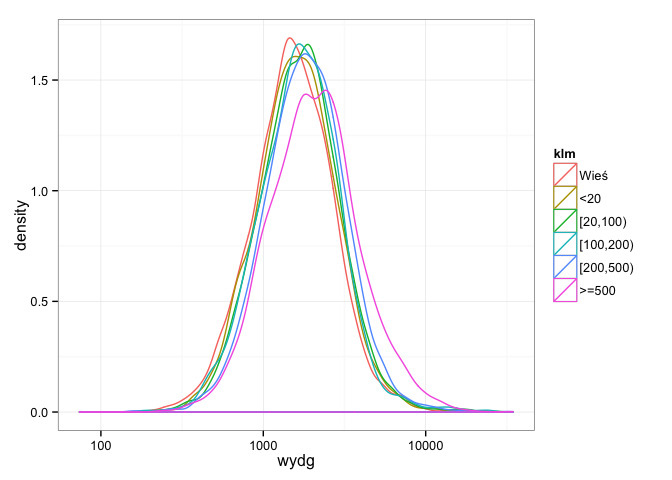 


## Wykresy pudełkowe

Jak poprawnie porównać rozkłady zmiennych? Histogramy i wykresy gęstości są użyteczne gdy nie mamy do czynienia z wartościami odstającymi czy ujemnymi (jak w przypadku).

Jak wygląda wykres pudełkowy?


Spróbujmy zrobić go w **R**! Czas na analizę.


```r
gosp <- gosp %>% 
  mutate(klm = factor( x = klm,
                       levels = 6:1,
                       labels = c('Wieś',
                                  '<20',
                                  '[20,100)',
                                  '[100,200)',
                                  '[200,500)',
                                  '>=500'),
                       ordered = T))
p <- gosp %>%
  ggplot(data = .,
         aes(x = klm,
             y = wydg)) +
  geom_boxplot()
p
```

```
## Warning: Removed 36 rows containing non-finite values (stat_boxplot).
```

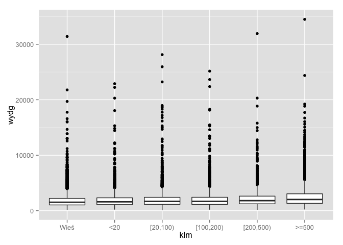 

Dodajmy skalę logarytmiczną


```r
p + scale_y_log10() + theme_bw()
```

```
## Warning: Removed 36 rows containing non-finite values (stat_boxplot).
```

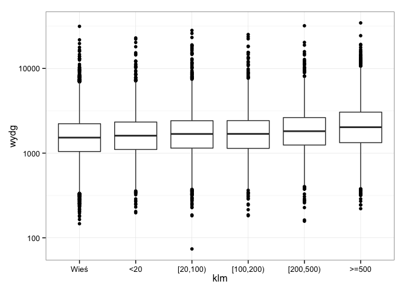 

Dodajmy też punkty (geom_jitter) - wersja pierwsza (ale po co to?)


```r
p + 
  scale_y_log10() + 
  theme_bw() +
  geom_jitter()
```

```
## Warning: Removed 36 rows containing non-finite values (stat_boxplot).
```

```
## Warning: Removed 36 rows containing missing values (geom_point).
```

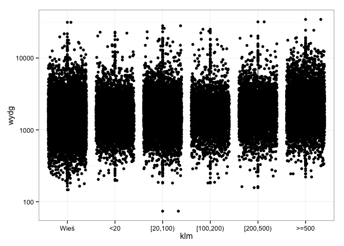 

Wersja poprawiona - dlaczego tak? Możemy zobaczyć jak rozkładają się dane!


```r
gosp %>%
  ggplot(data = .,
         aes(x = klm,
             y = wydg)) +
  geom_jitter(alpha=0.3) + 
  geom_boxplot() +
  scale_y_log10() + 
  theme_bw()
```

```
## Warning: Removed 36 rows containing non-finite values (stat_boxplot).
```

```
## Warning: Removed 36 rows containing missing values (geom_point).
```

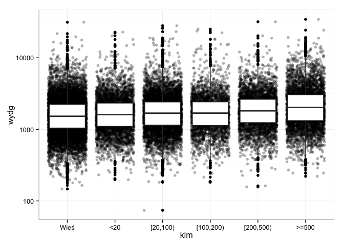 

A teraz porównajmy województwa


```r
gosp %>%
  ggplot(data = .,
         aes(x = woj,
             y = wydg)) +
  geom_jitter(alpha=0.1) + 
  geom_boxplot() +
  scale_y_log10() + 
  theme_bw()
```

```
## Warning: Removed 36 rows containing non-finite values (stat_boxplot).
```

```
## Warning: Removed 36 rows containing missing values (geom_point).
```

 


